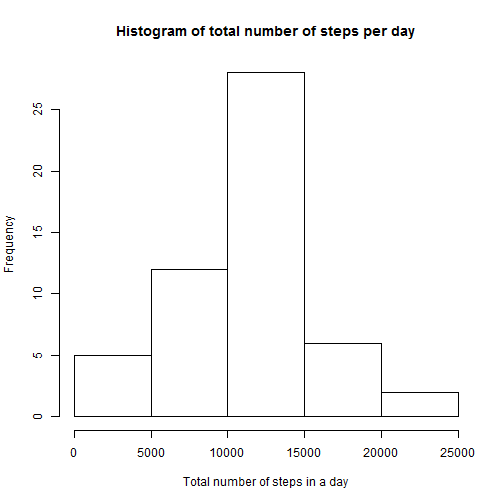
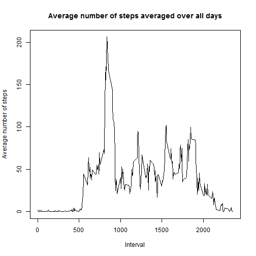
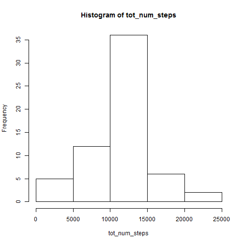
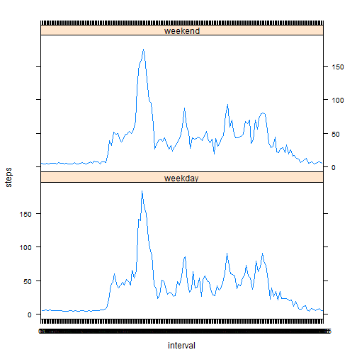

# Reproducible Research: Peer Assessment 1

See README.md 

## Loading and preprocessing the data
Dataset: [Activity monitoring data](https://d396qusza40orc.cloudfront.net/repdata%2Fdata%2Factivity.zip) [52K]

We're going to read the file as we do not know anything about it, but just this URL.


```r
f_url <- "http://d396qusza40orc.cloudfront.net/repdata%2Fdata%2Factivity.zip"
# create a temporary directory
tmp_dir = tempdir()
# create the placeholder file
tmp_fl = tempfile(tmpdir=tmp_dir, fileext=".zip")
# download into the placeholder file (I'm running on Windows OS: curl not needed)
download.file(f_url, tmp_fl, method="auto")
# get the name of the first file in the zip archive
f_name = unzip(tmp_fl, list=TRUE)$Name[1]
# unzip the file to the temporary directory
unzip(tmp_fl, files=f_name, exdir=tmp_dir, overwrite=TRUE)
# fpath is the full path to the extracted file
f_path = file.path(tmp_dir, f_name)
# load the csv in data frame
data <- read.csv(f_path, as.is=TRUE)
#This code is available by searching google.


# if you have got the file in your working directory, this line is enough to read it.
#data <- read.csv(unz("activity.zip", "activity.csv"))
```


## What is mean total number of steps taken per day?
###1 Make a histogram of the total number of steps taken each day

Now we can use that the column 'date' that was taken as a factor, in order to use it into the 'tapply' function. And then we can make the requested plot.  

```r
tot_num_steps <- tapply(data$steps, data$date, sum)
hist(tot_num_steps, main="Histogram of total number of steps per day", 
     xlab="Total number of steps in a day")
```

 

###2 Calculate and report the mean and median total number of steps taken per day  

Reporting 'mean' and 'median'.  

```r
mean(tot_num_steps, na.rm=TRUE)
```

```
## [1] 10766
```

```r
median(tot_num_steps, na.rm=TRUE)
```

```
## [1] 10765
```

## What is the average daily activity pattern?
###1 Make a time series plot (i.e. type = "l") of the 5-minute interval (x-axis) and the average number of steps taken, averaged across all days (y-axis)  

We must make 'interval' column as a factor.  

```r
data <- transform(data, interval = factor(interval))
```
And now we can use again 'tapply' function as above, but just with the new factor, and removing NA values.
And then, make the requested plot.  

```r
av_steps_interval <- tapply(data$steps, data$interval, mean, na.rm=TRUE)
plot(levels(data$interval), av_steps_interval, type="l",  main="Average number of steps averaged over all days", xlab="Interval", 
     ylab="Average number of steps")
```

 

###2 Which 5-minute interval, on average across all the days in the dataset, contains the maximum number of steps?  

This is not the best way to get this value, but it just works...  
We can make a new data frame (named 'my_tabla') with 2 columns: namely, intervals levels, and means of each day.  
Then we can order by 'means' column, and then show the first element of 'intervals' column.  

```r
my_tabla <- data.frame(intervals=levels(data$interval),mean_steps=av_steps_interval, stringsAsFactors=FALSE)
my_tabla <- my_tabla[order(my_tabla$mean_steps, decreasing=TRUE),]
my_tabla[1,]
```

```
##     intervals mean_steps
## 835       835      206.2
```
Result shows that *'835'* interval is the maximum number of steps, **8:35h**.  

## Imputing missing values
###1 Calculate and report the total number of missing values in the dataset (i.e. the total number of rows with NAs) 


```r
ok <- complete.cases(data)
tot_na <- ok[ok==FALSE]
length(tot_na)
```

```
## [1] 2304
```

###2  Devise a strategy for filling in all of the missing values in the dataset. The strategy does not need to be sophisticated. For example, you could use the mean/median for that day, or the mean for that 5-minute interval, etc.  

A non-sophisticated way to replace NA values, I think, is replacing them with the mean of the **entire steps column**. I know there are better ways to solve it... *this is one*.
We will notice that this mean will be truncated to make it *integer*, so errors will be greater than other approaches as using the mean of this day, or mean of this interval.

###3 Create a new dataset that is equal to the original dataset but with the missing data filled in.  

Overwritting original 'data'. Rows non-complete are filled in with the mean of *total steps*, forced to *integer*.  


```r
table_av_st_int <- aggregate(steps ~ interval, data, mean)
data$steps[is.na(data$steps)] <- as.integer(mean(data$steps, na.rm = TRUE))
```

###4 Make a histogram of the total number of steps taken each day and Calculate and report the **mean** and **median** total number of steps taken per day. Do these values differ from the estimates from the first part of the assignment? What is the impact of imputing missing data on the estimates of the total daily number of steps?


```r
tot_num_steps <- tapply(data$steps, data$date, sum)
hist(tot_num_steps)
```

 

Reporting new 'mean' and 'median'. (Notice that remove NAs is not needed).   


```r
mean(tot_num_steps)
```

```
## [1] 10752
```

```r
median(tot_num_steps)
```

```
## [1] 10656
```

As we can see, ***there's a slight difference*** between the first results and new ones. The mean and the median are almost exactly **the same**.  
So, the impact of imputing missing data is *acceptable*.     

## Are there differences in activity patterns between weekdays and weekends?  

We can turn string 'date' column into Date class with as.Date function.     

```r
data$date <- as.POSIXlt(data$date)
```
Now we'll add a new column that contains the week days (0 = Sunday, 1 = Monday, etc...)     

```r
 data$week_day <- as.factor(data$date$wday)
```
And a another new column that transforms weekend days (0=Sunday and 6=Saturday) to "weekend", or "weekday" the other days. Then, transforms it into a factor.  

```r
data$wday_wend <- data$wday_wend[data$week_day=="0" || data$week_day=="6"] <- c("weekend","weekday")
data <- transform(data, wday_wend=factor(wday_wend))
```
Finally, we'll create a new data frame with these columns: intervals , mean of steps by interval, and type of each day.   

```r
table_av_steps_interval_daytype <- aggregate(steps ~ interval+wday_wend, data, mean)
```


Now we can make the plot. Lattice package will be used.  

```r
library("lattice", lib.loc="C:/Program Files/R/R-3.1.1/library")
xyplot(steps ~ interval | wday_wend, data=table_av_steps_interval_daytype, layout=c(1,2), type="l")
```

 

Changing NAs by the mean of total days (not by the mean of this interval, or the mean of that day), makes the new mean and median slight deviation, and the differences in activity patterns between weekdays and weekends, are not very strong.


